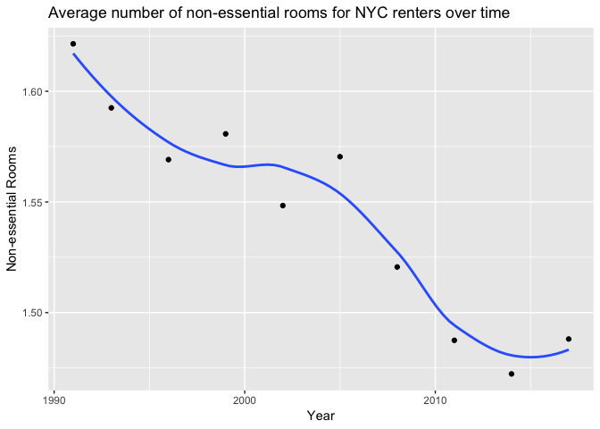

NYCHVS Data Analysis
================
Analyzing New York City housing data over the past three decades for the *UVA Cavalytics Spring Data Competition* and annual *American Statistical Association's* (ASA) <a href="https://www1.nyc.gov/site/hpd/about/nychvs-asa-data-challenge-expo.page?fbclid=IwAR0fN8TUt2UfJc3qzglI-MtMoG0WW_mky-b5Njv5yd2MdsO4Z4lp0WKiOxo#"><target = "blank">Data Challenge Expo</a>

-   [Research Question](#research-question)
-   [Hypothesis](#hypothesis)
-   [Data Cleaning](#data-cleaning)
-   [Major Findings](#major-findings)

Research Question
-----------------

The majority of housing units in NYC are renter-occupied according to this <a href="https://www.census.gov/programs-surveys/ahs/visualizations/metrobriefs-2013.html"><target = "blank">American Housing Survey</a> -- slightly over half of the city, as they found -- and so I decided to focus on renters for my research. Specifically, I am interested in how spending behavior on the essential expense of shelter has changed since the early 90's. **Are renters of NYC spending more or less relative to what they make in income?** What about those with mortgages or some sort of loan? Is there a change in spending behavior and if so, is the change consistent among renters and mortgagers, or among different demographics?

Hypothesis
----------

Due to record high debt levels in America, the expectation is that spending behavior on housing somewhat reflects that. That said, I foresee that residents of NYC are spending more than is comfortable to spend or more than what was reasonable for them to spend in years past.

Data Cleaning
-------------

*Feel free to skip past this to the analysis portion*

``` r
library(tidyverse)

csv91 <- "/Users/malcolm_mashig/Downloads/NYCHVS 1991 Occupied File for ASA Challenge_CSV.csv"
csv93 <- "/Users/malcolm_mashig/Downloads/NYCHVS 1993 Occupied File for ASA Challenge_CSV.csv"
csv96 <- "/Users/malcolm_mashig/Downloads/NYCHVS 1996 Occupied File for ASA Challenge_CSV.csv"
csv99 <- "/Users/malcolm_mashig/Downloads/NYCHVS 1999 Occupied File for ASA Challenge_CSV.csv"
csv02 <- "/Users/malcolm_mashig/Downloads/NYCHVS 2002 Occupied File for ASA Challenge_CSV.csv"
csv05 <- "/Users/malcolm_mashig/Downloads/NYCHVS 2005 Occupied File for ASA Challenge_CSV.csv"
csv08 <- "/Users/malcolm_mashig/Downloads/NYCHVS 2008 Occupied File for ASA Challenge_CSV.csv"
csv11 <- "/Users/malcolm_mashig/Downloads/NYCHVS 2011 Occupied File for ASA Challenge_CSV.csv"
csv14 <- "/Users/malcolm_mashig/Downloads/NYCHVS 2014 Occupied File for ASA Challenge_CSV.csv"
csv17 <- "/Users/malcolm_mashig/Downloads/NYCHVS 2017 Occupied File for ASA Challenge_CSV.csv"

relevant_cols <- c('borough' = 'Borough', 'building_condition' = 'Condition of building', 'age' = "Householder's Age Recode", 'sex' = "Householder's Sex", 'race' = "Householder's Race", 'hispanic_origin' = "Householder's Hispanic Origin", "move_in_year" = 'Year Householder Moved into Unit', 'mortgage' = "Mortgage Status", 'num_of_rooms' = "Number of rooms", 'num_of_bedrooms' = "Number of bedrooms", 'rent' = "Monthly contract rent", 'num_of_persons' = "Number of Persons Recode", 'gross_rent' = "Monthly Gross Rent", 'total_income' = "Total Household Income Recode") ## 15 total

data91 <- read_csv(csv91, skip = 1) %>% 
  as_tibble() %>% 
  select(relevant_cols) %>% 
  mutate('data_year' = 1991)

data93 <- read_csv(csv93, skip = 1) %>% 
  as_tibble() %>% 
  select(relevant_cols) %>% 
  mutate('data_year' = 1993)

data96 <- read_csv(csv96, skip = 1) %>% 
  as_tibble() %>% 
  select(relevant_cols) %>% 
  mutate('data_year' = 1996)

data99 <- read_csv(csv99, skip = 1) %>% 
  as_tibble() %>% 
  select(relevant_cols) %>% 
  mutate('data_year' = 1999)

data02 <- read_csv(csv02, skip = 1) %>% 
  as_tibble() %>% 
  select(relevant_cols) %>% 
  mutate('data_year' = 2002)

data05 <- read_csv(csv05, skip = 1) %>% 
  as_tibble() %>% 
  select(relevant_cols) %>% 
  mutate('data_year' = 2005)

data08 <- read_csv(csv08, skip = 1) %>% 
  as_tibble() %>% 
  select(relevant_cols) %>% 
  mutate('data_year' = 2008)

data11 <- read_csv(csv11, skip = 1) %>% 
  as_tibble() %>% 
  select(relevant_cols) %>% 
  mutate('data_year' = 2011)

data14 <- read_csv(csv14, skip = 1) %>% 
  as_tibble() %>% 
  select(relevant_cols) %>% 
  mutate('data_year' = 2014)

data17 <- read_csv(csv17, skip = 1) %>% 
  as_tibble() %>% 
  select(relevant_cols) %>% 
  mutate('data_year' = 2017)

merge1 <- full_join(data91, data93)
merge2 <- full_join(data96, data99)
merge3 <- full_join(data02, data05)
merge4 <- full_join(data08, data11)
merge5 <- full_join(data14, data17)
merge6 <- full_join(merge1, merge2)
merge7 <- full_join(merge3, merge4)
merge8 <- full_join(merge6, merge7)
merged_data <- full_join(merge8, merge5)

# check to see if all the data is represented after merge

count(data91) + count(data93) + count(data96) + count(data99) + count(data02) + count(data05) + count(data08) + count(data11) + count(data14) + count(data17) == count(merged_data)
```

    ##         n
    ## [1,] TRUE

``` r
# Decoding ----------------------------------------------------------------

# borough

merged_data[merged_data$borough == 1, 'borough'] <- 'bronx'
merged_data[merged_data$borough == 2, 'borough'] <- 'brooklyn'
merged_data[merged_data$borough == 3, 'borough'] <- 'manhattan'
merged_data[merged_data$borough == 4, 'borough'] <- 'queens'
merged_data[merged_data$borough == 5, 'borough'] <- 'staten_island'

# building condition

merged_data[merged_data$building_condition == 1, 'building_condition'] <- 'dilapidated'
merged_data[merged_data$building_condition == 2, 'building_condition'] <- 'sound'
merged_data[merged_data$building_condition == 3, 'building_condition'] <- 'detoriating'
merged_data[merged_data$building_condition == 8, 'building_condition'] <- NA

# Sex

merged_data[merged_data$sex == 1, 'sex'] <- 'male'
merged_data[merged_data$sex == 2, 'sex'] <- 'female'
merged_data[merged_data$sex == 8, 'sex'] <- NA

# Hispanic

merged_data[merged_data$hispanic_origin == 1, 'hispanic_origin'] <- 'non-hispanic'
merged_data[merged_data$hispanic_origin == 2, 'hispanic_origin'] <- 'puerto_rican'
merged_data[merged_data$hispanic_origin == 3, 'hispanic_origin'] <- 'dominican'
merged_data[merged_data$hispanic_origin == 4, 'hispanic_origin'] <- 'cuban'
merged_data[merged_data$hispanic_origin == 5, 'hispanic_origin'] <- 'so_ce_american'
merged_data[merged_data$hispanic_origin == 6, 'hispanic_origin'] <- 'mexican_am_chic'
merged_data[merged_data$hispanic_origin == 7, 'hispanic_origin'] <- 'other_span'
merged_data[merged_data$hispanic_origin == 8, 'hispanic_origin'] <- NA

# Race

merged_data[merged_data$race == 01, 'race'] <- 'white'
merged_data[merged_data$race == 02, 'race'] <- 'black'
merged_data[merged_data$race == 03, 'race'] <- 'native'
merged_data[merged_data$race == 04, 'race'] <- 'chinese'
merged_data[merged_data$race == 05, 'race'] <- 'filipino'
merged_data[merged_data$race == 06, 'race'] <- 'korean'
merged_data[merged_data$race == 07, 'race'] <- 'vietnamese'
merged_data[merged_data$race == 08, 'race'] <- 'asian_indian'
merged_data[merged_data$race == 09, 'race'] <- 'other_asian'
merged_data[merged_data$race == 10, 'race'] <- 'other'
merged_data[merged_data$race == 98, 'race'] <- NA

# Mortgage

merged_data[merged_data$mortgage == 1, 'mortgage'] <- 'yes'
merged_data[merged_data$mortgage == 2, 'mortgage'] <- 'owner'
merged_data[merged_data$mortgage == 8, 'mortgage'] <- NA

# Number of rooms

merged_data[merged_data$num_of_rooms == 9, 'num_of_rooms'] <- NA

# rent amount
merged_data[merged_data$rent == 99998, 'rent'] <- NA

# gross rent

merged_data[merged_data$gross_rent == 99998, 'gross_rent'] <- NA
merged_data[merged_data$gross_rent == 9999, 'gross_rent'] <- NA

# income

merged_data[merged_data$total_income == 999998, 'total_income'] <- NA
merged_data[merged_data == 999999] <- NA
merged_data[merged_data == 9999999] <- NA

# number of bedrooms

merged_data[merged_data$num_of_bedrooms == 98, 'num_of_bedrooms'] <- NA

# in general

merged_data[merged_data == 99999] <- NA
merged_data[merged_data == 9998] <- NA
```

Major Findings
--------------

#### **1. Over time, renters have sacrificed non-essential rooms**

Associated Code:

**NOTE** The variable `extra_rooms` is just the difference between the number of rooms in the house and the number of bedrooms in the house. They are the non-essential rooms in that the residents are not sleeping in them.

``` r
merged_data1 <- merged_data %>% 
  filter(num_of_persons <= num_of_bedrooms) %>% 
  mutate(extra_rooms = num_of_rooms - num_of_persons)

merged_data2 <- merged_data %>% 
  filter(num_of_persons > num_of_bedrooms) %>% 
  mutate(extra_rooms = num_of_rooms - num_of_bedrooms)

merged_data <- full_join(merged_data1, merged_data2)

renters <- merged_data %>% 
  filter(mortgage == 9)

extra_room_by_year <- renters %>% 
  group_by(data_year) %>% 
  summarise(mean_extra_room = mean(extra_rooms, na.rm = TRUE))

extra_room_by_year %>% as.data.frame()
```

    ##    data_year mean_extra_room
    ## 1       1991        1.621444
    ## 2       1993        1.592507
    ## 3       1996        1.569126
    ## 4       1999        1.580761
    ## 5       2002        1.548360
    ## 6       2005        1.570451
    ## 7       2008        1.520610
    ## 8       2011        1.487477
    ## 9       2014        1.472299
    ## 10      2017        1.488071

``` r
ggplot(extra_room_by_year, aes(data_year, mean_extra_room)) + 
  labs(x = "Year", y = "Non-essential Rooms", title = "Average number of non-essential rooms for NYC renters over time") +
  geom_point() + 
  geom_smooth(se = FALSE)
```



This results from the fact that, over time, the average number of rooms per person has generally decreased while the average number of bedrooms per person has generally increased.

``` r
rooms_per_person <- renters %>% 
  mutate(room_per_person = num_of_rooms / num_of_persons, 
         bedroom_per_person = num_of_bedrooms / num_of_persons) %>% 
  group_by(data_year) %>% 
  summarise(mean_room_per_person = mean(room_per_person, na.rm = TRUE),
            mean_bedroom_per_person = mean(bedroom_per_person, na.rm = TRUE))

rooms_per_person %>% as.data.frame()
```

    ##    data_year mean_room_per_person mean_bedroom_per_person
    ## 1       1991             1.960547                1.384173
    ## 2       1993             1.968109                1.405143
    ## 3       1996             1.947577                1.401505
    ## 4       1999             1.946067                1.401273
    ## 5       2002             1.930214                1.411141
    ## 6       2005             1.957164                1.428023
    ## 7       2008             1.947887                1.444603
    ## 8       2011             1.877712                1.389418
    ## 9       2014             1.890422                1.410715
    ## 10      2017             1.899409                1.429703

This decrease in non-essential rooms for NYC renters is not exactly consistent among all boroughs. The decrease is greatest in Staten Island and Queens.

``` r
extra_room_by_year.bor <- renters %>% 
  group_by(data_year, borough) %>% 
  summarise(mean_extra_room = mean(extra_rooms, na.rm = TRUE))

ggplot(extra_room_by_year.bor, aes(data_year, mean_extra_room, color = borough)) + 
  labs(x = "Year", y = "Non-essential Rooms", title = "Average number of non-essential rooms for NYC renters over time (by borough)") +
  geom_point() + 
  geom_smooth(se = FALSE)
```


